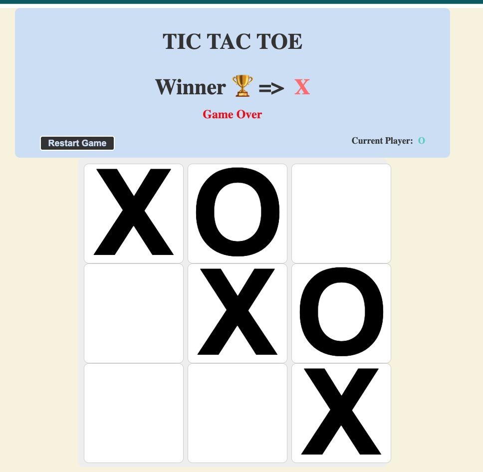

# Tic Tac Toe ❌⭕ 

A classic Tic Tac Toe game built with Angular. Play against a friend or challenge yourself in this timeless game of strategy.

## Screenshot



## Prerequisites

Before running this project, make sure you have:
- Node.js (version 16 or higher)
- npm (comes with Node.js)
- Angular CLI (`npm install -g @angular/cli`)

## How to run it

### install dependencies 

```bash
npm install
```

### Development server

To start a local development server, run:

```bash
ng serve
```

Once the server is running, open your browser and navigate to `http://localhost:4200/`. The application will automatically reload whenever you modify any of the source files.


## Building

To build the project run:

```bash
ng build
```

This will compile your project and store the build artifacts in the `dist/` directory. By default, the production build optimizes your application for performance and speed.

## Running unit tests

To execute unit tests with the [Karma](https://karma-runner.github.io) test runner, use the following command:

```bash
ng test
```

## Running end-to-end tests

For end-to-end (e2e) testing, run:

```bash
ng e2e
```

## TODO

* Game history
* Nicer design
* Winner animation